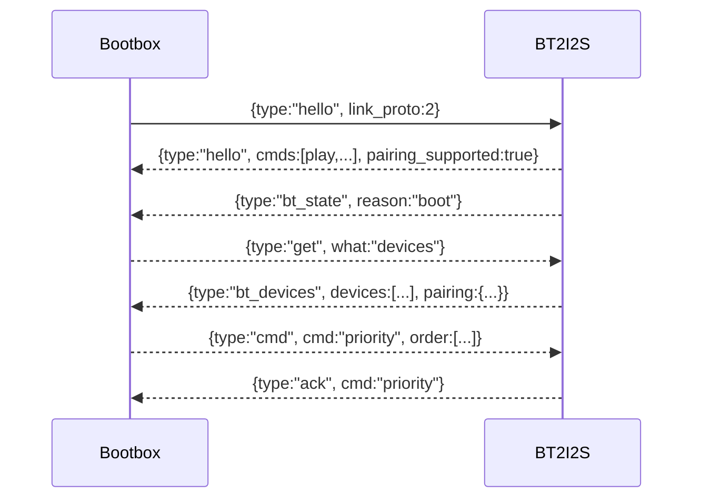

# Bootbox ↔ bt2i2s Link Protocol (UART JSON)

The Bootbox controller (ESP32-S3/ESP32) and bt2i2s bridge (ESP32 WROOM) communicate over UART2 using newline-delimited JSON frames. Both firmwares share the definitions in `firmware/arduino/common/link_config.h`.

## Transport
- UART2, 921600 baud, 8N1 (configurable via `LINK_UART_BAUD`).
- Bootbox pins: TX12/RX13 (S3) or TX17/RX16 (ESP32).
- bt2i2s pins: TX17/RX16.
- Heartbeat: `LINK_HEARTBEAT_MS` (1000 ms). Timeout: `LINK_TIMEOUT_MS` (3500 ms).
- Protocol version: `LINK_PROTO_VERSION = 2`.

## Frames (v2)
- `hello`: identity and capabilities.
- `bt_state`: connection/audio status, metadata, peer info, pairing state.
- `bt_devices`: paired device list + pairing status.
- `ack`: `{type:"ack", cmd?, status?}`
- `error`: `{type:"error", reason, detail?}`

### Commands accepted by bt2i2s
- Playback: `play`, `pause`, `toggle`, `next`, `prev`.
- Volume: `volume` with `pct` (0–100).
- State: `hello`, `state`, `devices`.
- Pairing/control: `pair_start` (`timeout_ms` optional), `pair_stop`, `connect` (`addr`), `forget` (`addr`), `priority` (`order` array of addrs).

### State payload (bt_state)
```
{
  "type":"bt_state",
  "reason":"boot|heartbeat|event",
  "connected":bool,
  "avrcp":bool,
  "audio_active":bool,
  "playing":bool,
  "volume_pct":0-100,
  "sample_rate_hz":44100,
  "title|artist|album":string?,
  "peer_addr":string?,
  "peer_name":string?,
  "pairing":{"active":bool,"remaining_ms":uint32},
  "paired_count":uint,
  "pairing_supported":bool
}
```

### Devices payload (bt_devices)
```
{
  "type":"bt_devices",
  "devices":[
    {"addr":"aa:bb:cc:dd:ee:ff","name":"phone","priority":1,
     "connected":true,"last_seen_ms":123456}
  ],
  "pairing":{"active":bool,"remaining_ms":uint32},
  "pairing_supported":bool
}
```

## Sequence (hello → state → devices)


## Compatibility workflow
- When adding/changing fields, bump `LINK_PROTO_VERSION` and keep parsing tolerant on Bootbox (optional fields) during rollout.
- Update both firmwares and the Web UI handlers together. Check `docs/Link-Compatibility.md` and this page before merging.
- Regression checklist:
  - Mutual hello/state exchange after cold boot and after link timeout.
  - Playback commands ack and reflect in subsequent bt_state.
  - Pairing controls (start/stop, connect, forget, priority) succeed and update bt_devices.
  - UI shows paired list and pairing status; volume/transport controls function.

## Debug knobs
- Bootbox: logs prefixed `[bt-link]` on Serial; set `BT_LINK_ENABLED=false` in `config.h` to disable.
- bt2i2s: set `DEBUG_LOG_STATE=true` in `config.h` for verbose TX/RX logging of link frames.
```
