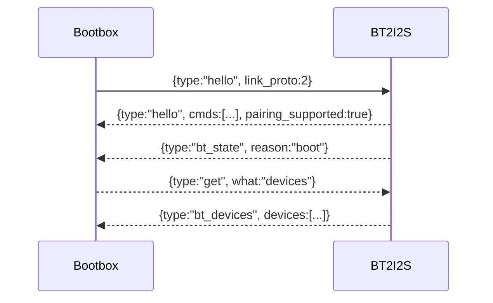

# bt2i2s Firmware (ESP32 WROOM)

Bluetooth A2DP/AVRCP sink that feeds the ADAU1701 over I2S and stays in lockstep with Bootbox over a UART JSON link. Build with:

```
arduino-cli compile --config-file arduino-cli.yaml --fqbn esp32:esp32:esp32 --libraries firmware/arduino/libraries firmware/arduino/bt2i2s
```

## Pin map (WROOM DevKitC)
- BT link UART: TX GPIO17, RX GPIO16 (921600 baud, UART2).
- I2S out to ADAU: BCLK GPIO26, LRCLK GPIO25, DOUT GPIO27, MCLK -1 (unused).
- USB UART debug: 115200 baud on the board’s USB bridge.

## Features
- A2DP sink with AVRCP callbacks (connection, playback, volume, metadata).
- I2S pipeline preconfigured for ADAU1701; can run master/slave (`I2S_MASTER_MODE`).
- UART link protocol v2: hello/state/ack/error, paired-device list, pairing control, connect/forget/priority.
- Preferences-backed paired device registry with autoconnect to the top-priority device.
- Volume control maps 0–100% to AVRCP 0–127; default volume 90% (DSP handles gain).

## Protocol (summary)
- Frames: newline-delimited JSON. Optional `id` echoed in responses.
- Hello: `{type:"hello", fw:"bt2i2s", fw_version, fw_build, bt_name, link_proto:2, uart_baud, pairing_supported:true, cmds:[...]}`
- State: `{type:"bt_state", reason:<event>, connected, avrcp, audio_active, playing, volume_pct, sample_rate_hz, title/artist/album?, peer_addr?, peer_name?, pairing:{active,remaining_ms}, paired_count}`
- Devices: `{type:"bt_devices", devices:[{addr,name,priority,connected,last_seen_ms}], pairing:{active,remaining_ms}, pairing_supported:true}`
- Commands accepted: `play/pause/toggle/next/prev/volume(pct)`, `hello`, `state`, `pair_start(timeout_ms)`, `pair_stop`, `connect(addr)`, `forget(addr)`, `priority(order[])`, `devices` (get list).

Mermaid timing (hello/state/ack):


## Build-time knobs (`config.h`)
- `BT_DEVICE_NAME`, `BT_AUTO_RECONNECT`, `BT_DEFAULT_VOLUME_PERCENT`.
- I2S pins/frequency: `PIN_I2S_BCLK/LRCLK/DOUT/MCLK`, `I2S_MASTER_MODE`, `I2S_DMA_*`, `I2S_USE_APLL`.
- Link: UART pins, `LINK_UART_NUM`, baud/heartbeat/proto from `common/link_config.h`.
- Debug: `DEBUG_LOG_STATE` for verbose serial link dumps.

## Runtime behavior
- Heartbeat: `LINK_STATUS_INTERVAL_MS` (1000 ms) pushes bt_state if idle.
- Timeout/backoff: if no frames within 3500 ms, Bootbox marks link offline; bt2i2s will resend hello/state when polled.
- Pairing: `pair_start` opens discoverable/connectable mode for a timeout (default 120s), then reverts to connectable-only.
- Autoconnect: on boot or disconnect, attempts to reconnect to highest-priority paired device (if `BT_AUTO_RECONNECT`).

## Not implemented / limitations
- Track position reporting and OTA updates are not wired yet.
- MCLK generation is left at -1; provide an external MCLK if your ADAU setup needs it.
- RSSI/remote name are not surfaced to Bootbox.
